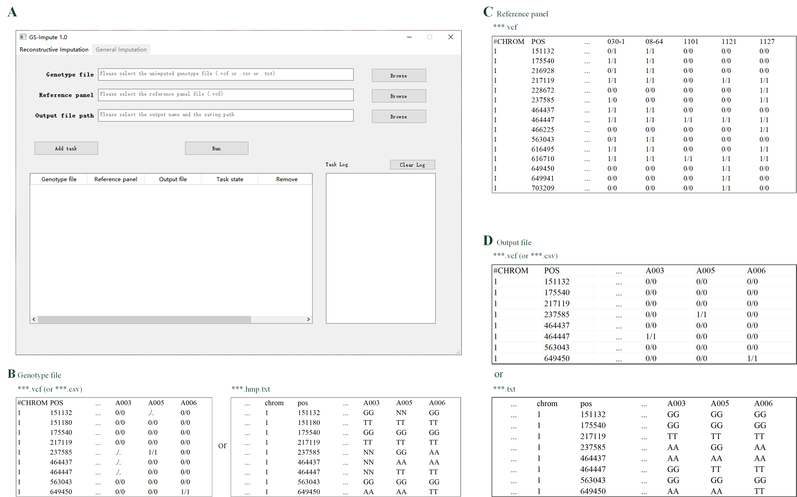
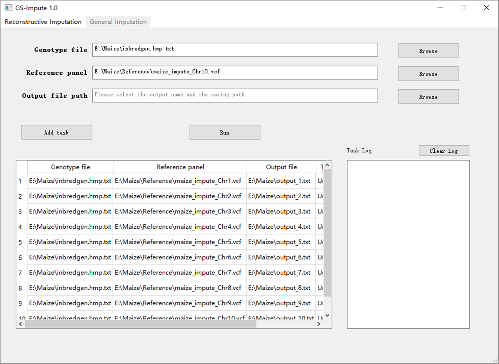
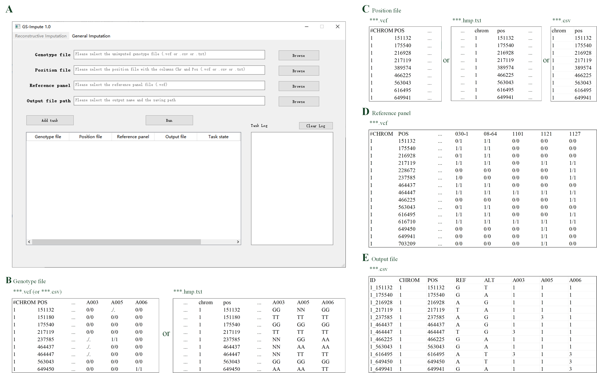
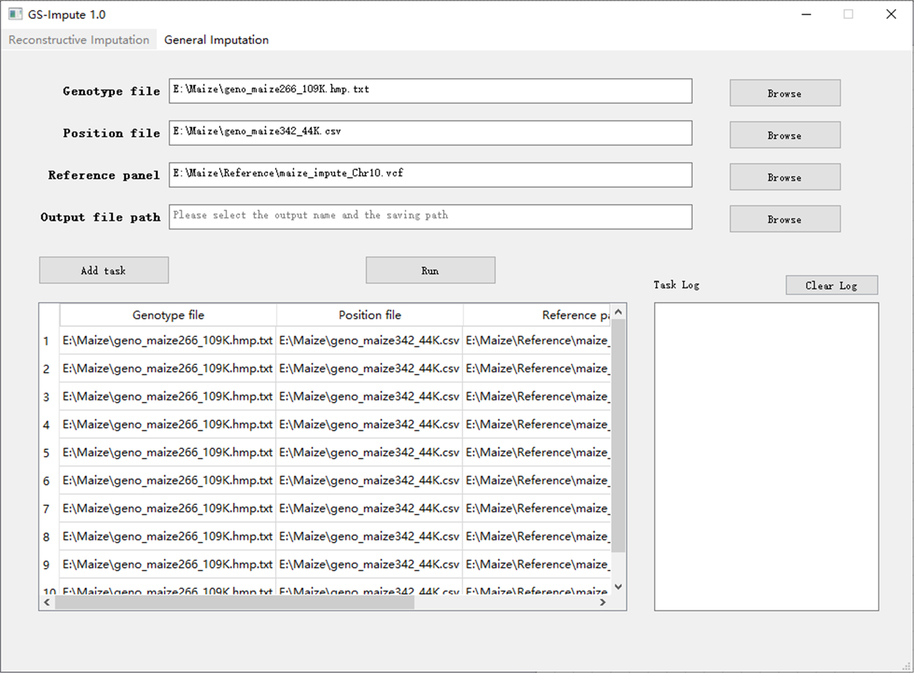

# GS-Impute: accurate genotype imputation via neural networks for across-population genomic selection with low-density markers

The Python project 'GS-Impute' can be used to implement genotype imputation for across-population genomic selection with low-density markers. Compatible with both Windows and Linux operating systems, it can efficiently process genotype data in multiple file formats (VCF, CSV and TXT). More information could be found in the user manual.

## The user manual of GS-Impute v1.0

System Requirements:

PyTorch installation (mandatory)

GPU-enabled PyTorch version (recommended)

Here are the install commands of PyTorch. Scroll down for the step-by-step instructions.

**1 Step-by-step instructions of installing PyTorch**

**1.1 Install Miniconda**

Miniconda is the recommended approach for installing PyTorch with GPU support. It creates a separate environment to avoid changing any installed software in your system. This is also the easiest way to install the required software especially for the GPU setup. Download the Miniconda Windows Installer (*https://repo.anaconda.com/miniconda/Miniconda3-latest-Windows-x86\_64.exe*) or the Miniconda Linux Installer (*https://repo.anaconda.com/miniconda/Miniconda3-latest-Linux-x86.sh*). Follow the on-screen instructions and choose the default options.

**1.2 Create a Conda environment**

Open a terminal (by clicking on the “Anaconda Promp” button through the Start menu in Windows). Create a Conda virtual environment named pytorch (other names are also acceptable) with the following commands [in a terminal window](http://dict.cn/To%20do%20this%2C%20just%20issue%20the%20following%20command%20in%20a%20terminal%20window) (taking python 3.9 as an example).

*conda create --name pytorch python=3.9*

You can deactivate and activate it with the following commands.

*conda deactivate*

*conda activate pytorch*

Make sure it is activated for the rest of the installation.

**1.3 Install PyTorch**

Install PyTorch (with GPU support) using the following command (taking NVIDIA RTX 4090 as an example).

*pip3 install torch torchvision torchaudio --index-url* [*https://download.pytorch.org/whl/cu118*](https://download.pytorch.org/whl/cu118)

If you are not using a GPU (not recommended), run the following command.

*pip3 install torch torchvision torchaudio*

**2 Install GS-Impute**

You should download the GSImpute v1.0\_Windows package. If under the Windows operating system, open [a terminal window](http://dict.cn/To%20do%20this%2C%20just%20issue%20the%20following%20command%20in%20a%20terminal%20window) and navigate to the download directory (taking “D:\GSImpute v1.0\_Windows” as an example). Then activate your Conda environment that has already installed PyTorch, and install GS-Impute with the following commands.

*D:*

*cd GSImpute v1.0\_Windows*

*conda activate pytorch*

*python install.py*

**3 Usage**

**3.1 For the Windows operating system**

In a Windows operating system, a typical command for running GS-Impute is as follows:

*gsi*

Once you execute the command above in [a terminal window](http://dict.cn/To%20do%20this%2C%20just%20issue%20the%20following%20command%20in%20a%20terminal%20window), general imputation screen will be opened by default. The software interface and input/output format examples are shown in Fig. 1.

**Fig. 1. Software interface on Windows system and input/output format examples of GS-Impute 1.0 for** **general imputation. (A)** The user interface of GS-Impute 1.0 for general imputation on Windows system. **(B)** The format example of the genotype file input for general imputation, where "..." represents some non-critical information. The file is allowed to contain markers of multiple chromosomes. For a genotype file in CSV or TXT format, the head of the column before valid genotype data must be ref, alt, or QCcode. **(C)** The format example of the reference panel input for general imputation. The panel should be a VCF file of a single chromosome, and only markers on the chromosome can be imputed. Missing markers are not permitted on the panel. **(D)** The format example of the output file for general imputation.

You can click the “*Browse*” button on the right side to select the genotype file, the reference panel and the output file path.

Once you have selected all the files, you can click the “*Add task*” button to add general imputation tasks to the task list (Fig. 2).

**Fig. 2. Software interface of GS-Impute 1.0 with general imputation tasks added**

If all tasks have been added, you can click the “*Run*” button to execute the tasks. GS-Impute will execute tasks in the order of the task list.

During task execution, the task log on the right shows real-time progress and detailed information of the tasks.

You can also click the “*Reconstructive Imputation*” button to perform your reconstructive imputation (Fig. 3).

**Fig. 3. Software interface on Windows system and input/output format examples of GS-Impute 1.0 for reconstructive imputation. (A)** The user interface of GS-Impute 1.0 for reconstructive imputation on Windows system. **(B)** The format example of the genotype file input for reconstructive imputation, where "..." represents some non-critical information. The file is allowed to contain markers of multiple chromosomes. For a genotype file in CSV or TXT format, the head of the column before valid genotype data must be ref, alt, or QCcode. **(C)** The format example of the position file input for reconstructive imputation. It is allowed to contain position information of multiple chromosomes. A genotype file containing chromosome and position information can also serve as the position file. **(D)** The format example of the reference panel input for reconstructive imputation. The panel should be a VCF file of a single chromosome, and only markers on the chromosome can be imputed. Missing markers are not permitted on the panel. **(E)** The format example of the output file for reconstructive imputation. The genotype values of 1 and 3 represent homozygous variants with two reference alleles and two alternate alleles, respectively. The genotype value of 2 represents a heterozygous variant that has one copy of the reference allele and one copy of the alternate allele.

**Fig. 4. Software interface of GS-Impute 1.0 with reconstructive imputation tasks added**

**3.2 For the Linux operating system**

A typical GS-Impute command for the general imputation is as follows:

*gsi -i -geno unimputed\_geno\_file.vcf -panel panel\_file.vcf*

Or

*gsi -i -geno unimputed\_geno\_file.csv -panel panel\_file.vcf*

Or

*gsi -i -geno unimputed\_geno\_file.hmp.txt -panel panel\_file.vcf*

A typical GS-Impute command for the reconstructive imputation is as follows:

*gsi -r -geno unimputed\_geno\_file.vcf -pos position\_file.vcf -panel panel\_file.vcf*

Or

*gsi -r -geno unimputed\_geno\_file.csv -pos position\_file.vcf -panel panel\_file.vcf*

Or

*gsi -r -geno unimputed\_geno\_file.hmp.txt -pos position\_file.vcf -panel panel\_file.vcf*

Or

*gsi -r -geno unimputed\_geno\_file.vcf -pos position\_file.hmp.txt -panel panel\_file.vcf*

Or

*gsi -r -geno unimputed\_geno\_file.csv -pos position\_file.hmp.txt -panel panel\_file.vcf*

Or

*gsi -r -geno unimputed\_geno\_file.hmp.txt -pos position\_file.hmp.txt -panel panel\_file.vcf*

Or

*gsi -r -geno unimputed\_geno\_file.vcf -pos position\_file.csv -panel panel\_file.vcf*

Or

*gsi -r -geno unimputed\_geno\_file.csv -pos position\_file.csv -panel panel\_file.vcf*

Or

*gsi -r -geno unimputed\_geno\_file.hmp.txt -pos position\_file.csv -panel panel\_file.vcf*

The file names of *unimputed\_geno\_file*, *position\_file* and *panel\_file* (listed above) can be freely defined, but their formats must strictly conform to the requirements specified in Fig. 1 and Fig. 3.

GS-Impute allows batch execution of imputation tasks via shell scripts in Linux. Please store the unimputed genotype files and the reference panels in the same directory, and then create a shell script file, such as *gsi.sh*. Type the imputation commands following the example below, and then save it.

*gsi -i -geno unimputed\_geno\_file1.vcf -panel panel\_file1.vcf -out outputfile1*

*gsi -i -geno unimputed\_geno\_file2.vcf -panel panel\_file2.vcf -out outputfile2*

Open the terminal in the current directory. Activate the virtual environment “pytorch” and use the bash command to execute the shell script.

*bash gsi.sh*

The program will perform the imputation tasks in the order of the shell script, and the imputed files will be output in the current directory.
